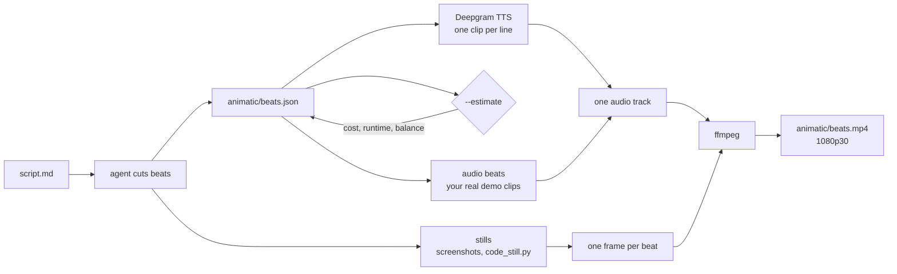

# animatic

A skill that turns a video script into an animatic: a narrated draft you can watch before you film anything.

Your agent cuts the script into beats, makes a still for each one showing what the viewer should see, and has TTS read your lines over them. What you get back is an mp4 you can drop on a timeline. You find out whether the video works, and how long it runs, before you've set up a camera.

## How it works



1. **Beats.** One per change in what's on screen. Each beat has what's said, what's shown, and optionally a still, a sound clip, or a hold for silence.
2. **Narration.** Each line goes to a text-to-speech API. This uses Deepgram's `/v2/speak`. `tts()` is the only function you'd change to use another provider.
3. **Frames.** A beat with a still shows the still with the line captioned underneath. A beat without one gets a text card.
4. **Render.** The audio is joined into one track, and each frame is held for exactly as long as its piece of that track, so the picture never drifts from the sound.

The runtime is a floor: you'll run longer on camera than TTS does.

## Install

```bash
git clone https://github.com/samgutentag-deepgram/animatic-skill ~/.claude/skills/animatic
pip install pillow   # or in a venv; plus ffmpeg: brew install ffmpeg
```

Then type `/animatic path/to/script.md`. No Deepgram key yet? The skill notices on the first run and walks you through getting one. Any agent that reads the [Agent Skills](https://agentskills.io) format can use it.

## Prompts

You ask, the agent runs it.

| You want to | Ask your agent |
|---|---|
| Check you have a key | `/animatic` am I set up? |
| Know the cost first | `/animatic scripts/intro.md`, but tell me what it costs before you render |
| Render it | `/animatic scripts/intro.md` |
| A faster voice | render that again, a bit faster |
| A different voice | use the haley voice this time |
| Price it for your plan | price it at the Growth rate, $0.0405 per 1k characters |
| Play your real demo clip | play `demo.wav` where the script runs the demo |
| Show code on screen | use `app.py` lines 12 to 20 as the still for the setup beat |

## Commands

The same things, if you'd rather drive. Run them from your project folder.

```bash
S=~/.claude/skills/animatic/scripts

python3 $S/make_animatic.py                                          # check you have a key
python3 $S/make_animatic.py animatic/beats.json --estimate           # cost, runtime, balance. no TTS calls
python3 $S/make_animatic.py animatic/beats.json                      # render
python3 $S/make_animatic.py animatic/beats.json --speed 1.3          # faster voice, 0.5 to 1.5
python3 $S/make_animatic.py animatic/beats.json --voice flux-haley-en
python3 $S/make_animatic.py animatic/beats.json --estimate --price 0.0405
python3 $S/code_still.py app.py animatic/03.png --lines 12-20        # code as a still, lines lit
```

Beat shapes, from [BEATS.md](BEATS.md):

| The real video does | Beat |
|---|---|
| You talk over a picture | `{"show": "...", "say": "...", "still": "01.png"}` |
| You talk to camera | `{"show": "to camera", "say": "..."}` |
| A demo clip plays | `{"show": "the clip", "audio": "demo.wav"}` |
| A command runs, nobody talks | `{"show": "terminal", "hold": 4}` |

## Example

[`examples/animatic-skill-demo`](examples/animatic-skill-demo) is the animatic of this skill, made with this skill: the `beats.json` an agent wrote, the five stills, and `make_stills.py`, which drew them (macOS fonts). Run `python3 $S/make_animatic.py examples/animatic-skill-demo/animatic/beats.json` to render it yourself, about 27 seconds.

## Cost

`--estimate` counts the characters, prices them (Flux TTS is $0.045 per 1k characters pay-as-you-go), estimates the runtime, and reads your remaining Deepgram balance. It makes no TTS calls. If the balance won't cover the run, it tells you to top up in the console. Reading the balance needs a key with the `billing:read` scope; without one, the estimate still prices the run and says the balance is unknown. A three minute script is about 2,000 characters, roughly ten cents.

## License

MIT
